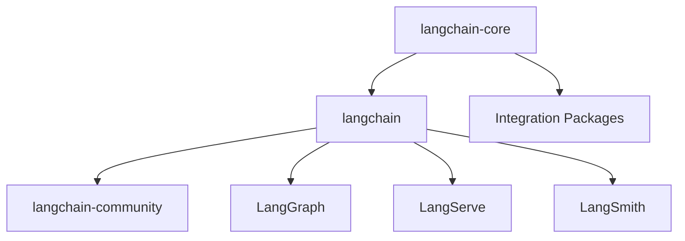

## Introduction to LangChain, LangGraph, and LangSmith

### What are LangChain, LangGraph, and LangSmith?

- **LangChain**: An open‑source framework for building LLM‑powered applications with modular primitives like prompts, chains, tools, and agents. It standardizes LLM integration and orchestration so you can compose complex behaviors quickly.
- **LangGraph**: A stateful orchestration framework in the LangChain ecosystem for building multi‑step, multi‑actor applications as graphs (nodes and edges). It supports persistence, streaming, and robust control flow.
- **LangSmith**: A developer platform for debugging, testing, evaluating, and monitoring LLM applications. It helps move from prototype to production with tracing and evaluation tooling.

References: [LangChain docs](https://python.langchain.com/docs/introduction/?utm_source=openai)

### Why LangChain?

- **Simplified integration**: Consistent APIs over many model providers and tools.
- **Modular components**: Compose prompts, chains, agents, and retrieval strategies.
- **Extensible**: Add custom tools, memory, and integrations as needed.
- **Rich ecosystem**: Community packages, examples, and maintained integrations.

### A short example using Gemini and Python

Install the integration package:

```bash
pip install -qU "langchain[google-genai]"
```

Initialize and invoke the model:

```python
import os
import getpass
from langchain.chat_models import init_chat_model

if not os.environ.get("GOOGLE_API_KEY"):
    os.environ["GOOGLE_API_KEY"] = getpass.getpass("Enter API key for Google Gemini: ")

model = init_chat_model("gemini-2.5-flash", model_provider="google_genai")
response = model.invoke("Hello, world!")
print(response)
```

### Architecture of LangChain

LangChain is organized into several libraries and services:

- **`langchain-core`**: Base abstractions for chat models and common components.
- **Integration packages**: Lightweight provider SDKs (e.g., `langchain-openai`, `langchain-anthropic`).
- **`langchain`**: Higher‑level chains, agents, retrieval strategies—cognitive building blocks.
- **`langchain-community`**: Community‑maintained integrations.
- **LangGraph**: Orchestration layer for robust, stateful multi‑step apps.
- **LangServe**: Deployment layer to host chains as production APIs.
- **LangSmith**: Observability and evaluation platform for debugging and monitoring.

### LangChain Architecture Diagram (Mermaid)



### Simple use cases

1. **Conversational agents**: Virtual assistants and chatbots with context and tools.
2. **Document summarization**: Condense long texts into concise summaries.
3. **Question answering**: Answer queries over provided context or indexed corpora.

### What LangChain cannot do (limitations)

- **Bound by LLM capabilities**: Quality depends on the underlying model (e.g., hallucinations, context limits).
- **Complexity for advanced apps**: Sophisticated agentic systems require deeper expertise.
- **Resource intensive**: Large models and retrieval pipelines can be costly to run at scale.

### Conclusions

LangChain provides a powerful, modular foundation for building LLM applications, while LangGraph enables robust orchestration and LangSmith delivers observability and evaluation. Together they streamline going from prototype to production, though success still depends on careful design choices and the capabilities of the underlying models.


