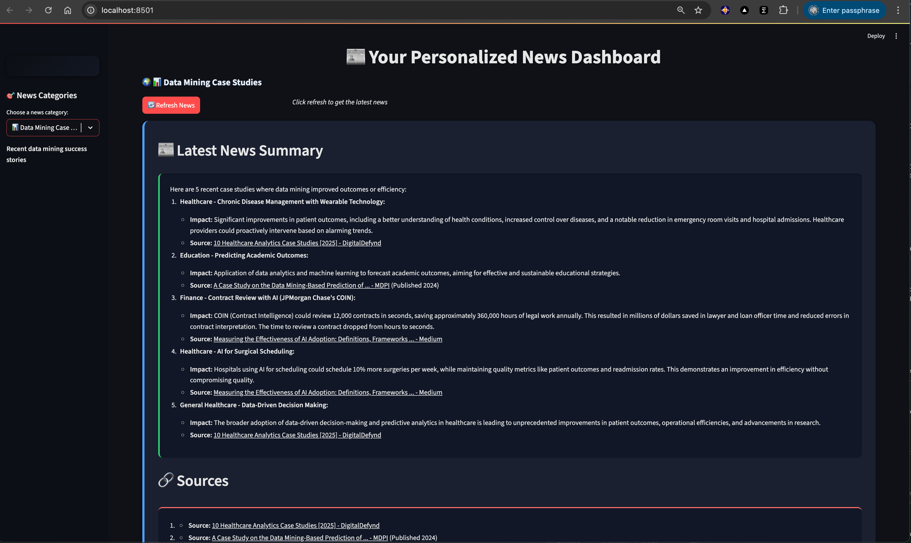

# 📰 Personalized News Dashboard

A Streamlit application that provides an easy way to read news based on your specific interests using AI-powered news aggregation.

## 🎯 News Categories

The app includes the following news categories:

- **🤖 LLM/AI News**: Latest developments in AI and Large Language Models
- **🌍 Russia-Ukraine Conflict**: Recent updates on the ongoing conflict
- **🌊 Vietnam Flood Status**: Current situation of flooding in Vietnam
- **♟️ Magnus Carlsen Chess**: Latest chess games and achievements
- **📊 Data Mining Case Studies**: Recent data mining success stories
- **🇦🇺 ABC Australia News**: Latest news from ABC Australia

## 🚀 Setup Instructions

### Prerequisites

1. Make sure you have Python 3.8+ installed
2. Ensure you have the same virtual environment setup as the original notebook
3. Make sure your `.env.local` file is properly configured with API keys

### Installation

1. Navigate to the project directory:
   ```bash
   cd /path/to/your/project
   ```

```bash 
python3.13 -m venv .venv
source .venv/bin/activate
```
2. Install the required dependencies:
   ```bash
   pip install -r requirements.txt
   ```

### Running the App

1. Start the Streamlit app:
   ```bash
   streamlit run app.py
   ```

2. Open your browser and navigate to the URL shown in the terminal (usually `http://localhost:8501`)

## 🎨 Features

- **Clean, Modern UI**: Beautiful interface with custom styling
- **Real-time News**: Get the latest news from multiple sources
- **Easy Navigation**: Sidebar with categorized news sections
- **Refresh Functionality**: Click refresh to get updated news
- **Source Attribution**: All news includes proper source links
- **Responsive Design**: Works well on different screen sizes

## 🔧 Configuration

The app uses the same environment setup as your notebook:
- Google Generative AI API key
- Tavily API key
- Other environment variables from `.env.local`

## 📱 Usage

1. **Select a Category**: Use the sidebar to choose your preferred news category
2. **Read News**: The selected category's latest news will be displayed
3. **Refresh**: Click the refresh button to get the most recent updates
4. **Explore Sources**: Click on source links to read full articles

## 🛠️ Technical Details

- **Framework**: Streamlit
- **AI Agent**: LangGraph with ReAct pattern
- **LLM**: Google Gemini 2.5 Flash
- **Search Tool**: Tavily Search API
- **Styling**: Custom CSS for enhanced user experience

## 🔄 Updates

The app automatically fetches fresh news each time you:
- Select a different category
- Click the refresh button
- Reload the page

## 📝 Notes

- News fetching may take a few seconds depending on the category
- All news content is sourced from reliable news outlets
- The app maintains the same agent setup as your notebook for consistency

## ➕ Add a New News Category

To add a new news category to the dashboard, follow these steps:

### 1. Edit `config.py`

Open the `config.py` file and add a new entry to the `NEWS_CATEGORIES` dictionary. Here's an example for adding "Bitcoin (BTC) price changes and news":

```python
NEWS_CATEGORIES = {
    # ... existing categories ...
    
    "₿ Bitcoin (BTC) News": {
        "prompt": "Search for the latest 5 news headlines about Bitcoin (BTC) price changes, market analysis, and significant developments. For each headline, provide: a) the title, b) a brief summary (under 50 words), c) current BTC price if mentioned. Focus on recent price movements, regulatory news, and major Bitcoin-related events.",
        "description": "Latest Bitcoin price changes, market analysis, and crypto news",
        "icon": "₿"
    }
}
```

### 2. Category Configuration Structure

Each category requires three fields:

- **`prompt`**: The search query sent to the AI agent. Be specific about what information you want.
- **`description`**: A brief description that appears in the sidebar.
- **`icon`**: An emoji or symbol to represent the category visually.

### 3. Best Practices for Prompts

- **Be Specific**: Include keywords that will help the AI find relevant news
- **Request Structure**: Ask for specific information like titles, summaries, or metrics
- **Source Requirements**: Always ask for source links
- **Time Constraints**: Specify if you want recent news (e.g., "latest", "past 24 hours")
- **Quantity**: Specify how many headlines or items you want

### 4. Example Prompts

```python
# For cryptocurrency news
"Search for the latest 5 news headlines about Bitcoin (BTC) price changes, market analysis, and significant developments. For each headline, provide: a) the title, b) a brief summary (under 50 words), c) current BTC price if mentioned."

# For sports news
"What are the top 5 sports headlines today? Focus on major leagues and significant events. For each headline, provide the title and a brief summary."

# For technology news
"Search for the latest 5 technology news headlines, focusing on AI, software, and hardware developments. Include brief summaries and source links."
```

### 5. Testing Your New Category

1. Save the `config.py` file
2. Restart the Streamlit app: `streamlit run app.py`
3. Select your new category from the sidebar
4. Verify that the news content is relevant and properly formatted

### 6. Customization Tips

- **Icons**: Use relevant emojis or symbols (e.g., ₿ for Bitcoin, 🏀 for basketball)
- **Descriptions**: Keep them concise but informative
- **Prompts**: Test different prompt variations to get the best results
- **Categories**: Consider grouping related topics (e.g., "Cryptocurrency News" instead of separate Bitcoin/Ethereum categories)

# Screenshots

 
 
