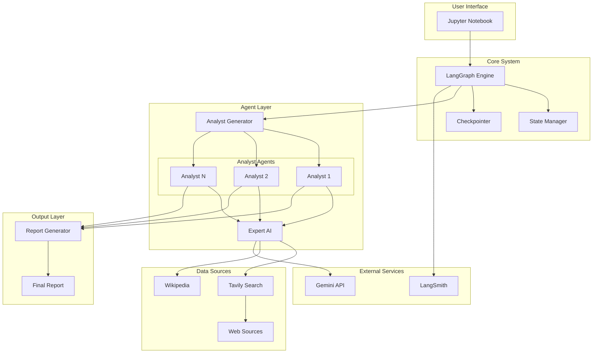
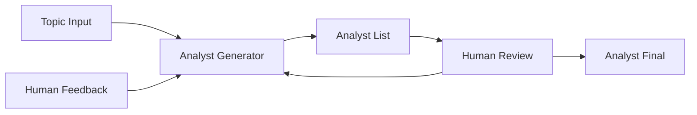
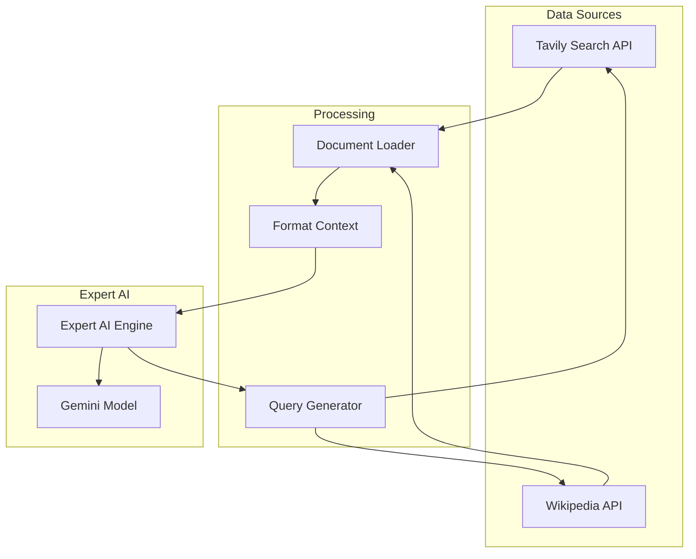
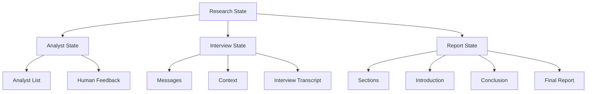
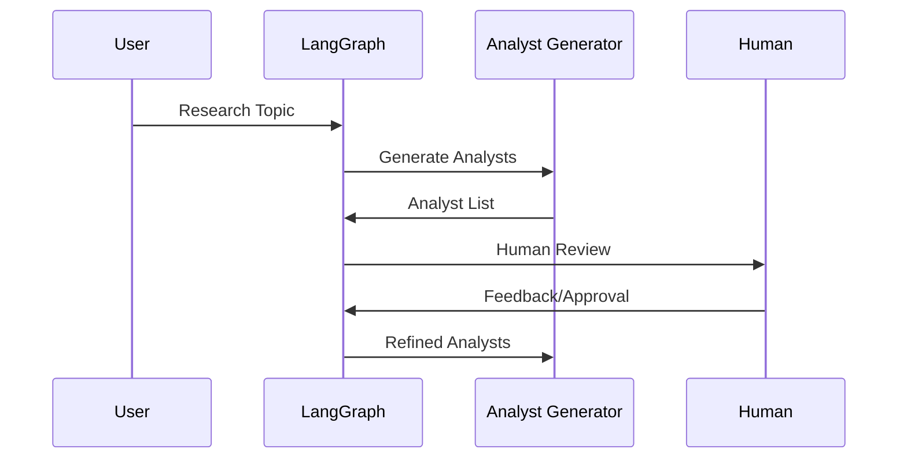
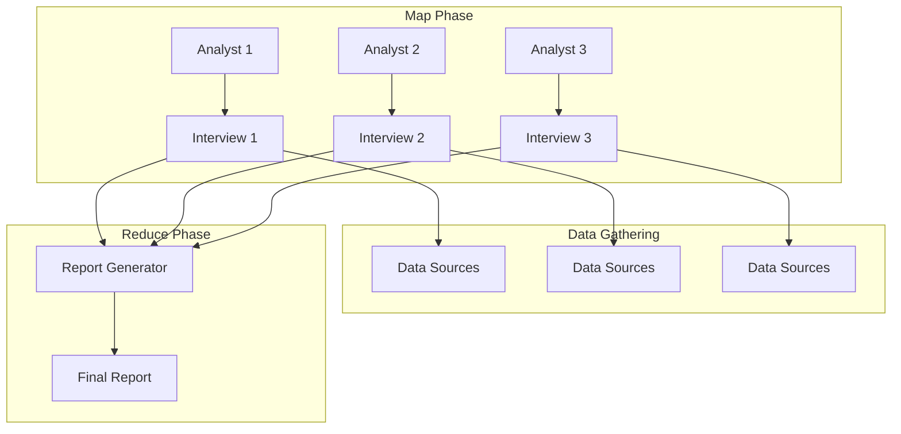
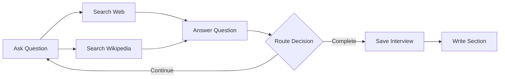
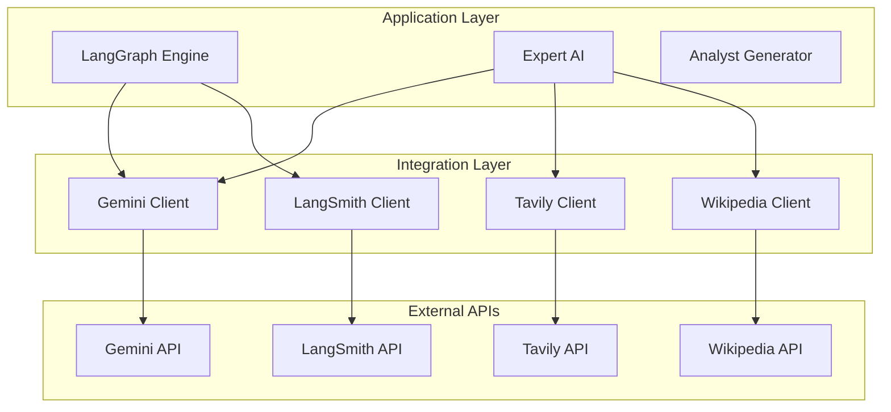

# Architecture

This document describes the high-level architecture of the Research Collective system, including its components, interactions, and design patterns.

## System Overview

The Research Collective is built as a multi-agent system using LangGraph, where specialized AI analysts work in parallel to research topics through structured interviews with expert AIs.

## High-Level Architecture

## Component Architecture

### 1. LangGraph Engine
The core orchestration engine that manages the entire workflow.

**Responsibilities:**
- Graph execution and state management
- Node coordination and routing
- Parallel processing with Send API
- Human-in-the-loop interactions

**Key Components:**
- StateGraph: Main graph structure
- MemorySaver: State persistence
- Checkpointer: Session management

### 2. Agent Layer

#### Analyst Generator
Creates specialized AI analyst personas based on the research topic.

#### Individual Analysts
Each analyst is a specialized AI persona with:
- **Role**: Specific function (e.g., Technical Expert, Business Analyst)
- **Affiliation**: Organization or perspective
- **Focus**: Particular aspect of the research topic
- **Persona**: Character and communication style

#### Expert AI
The knowledge-gathering system that:
- Receives questions from analysts
- Searches multiple data sources
- Synthesizes information
- Provides comprehensive answers

### 3. Data Integration Layer

### 4. State Management Architecture

The system uses a hierarchical state structure:

## Data Flow Architecture

### 1. Input Processing

### 2. Parallel Interview Processing

### 3. Interview Sub-Graph Architecture
Each interview runs as an independent sub-graph:

## Integration Architecture

### API Integration Layer

