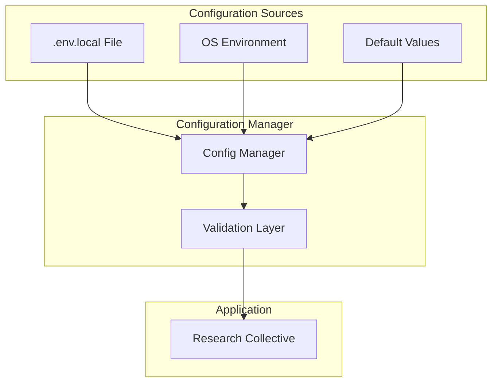
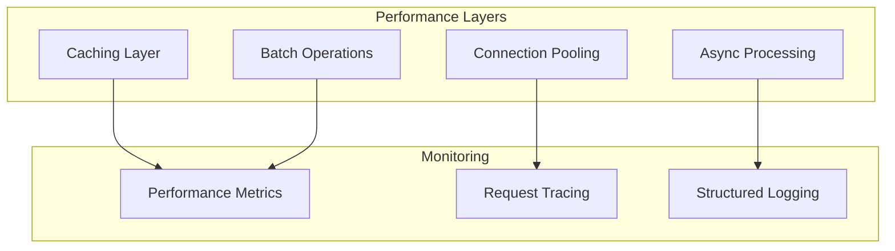
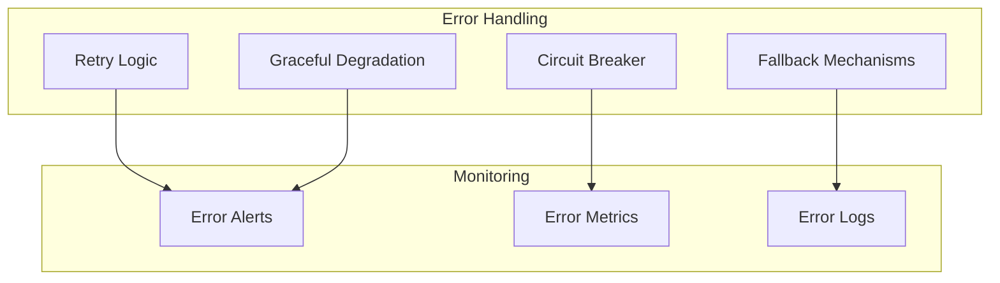
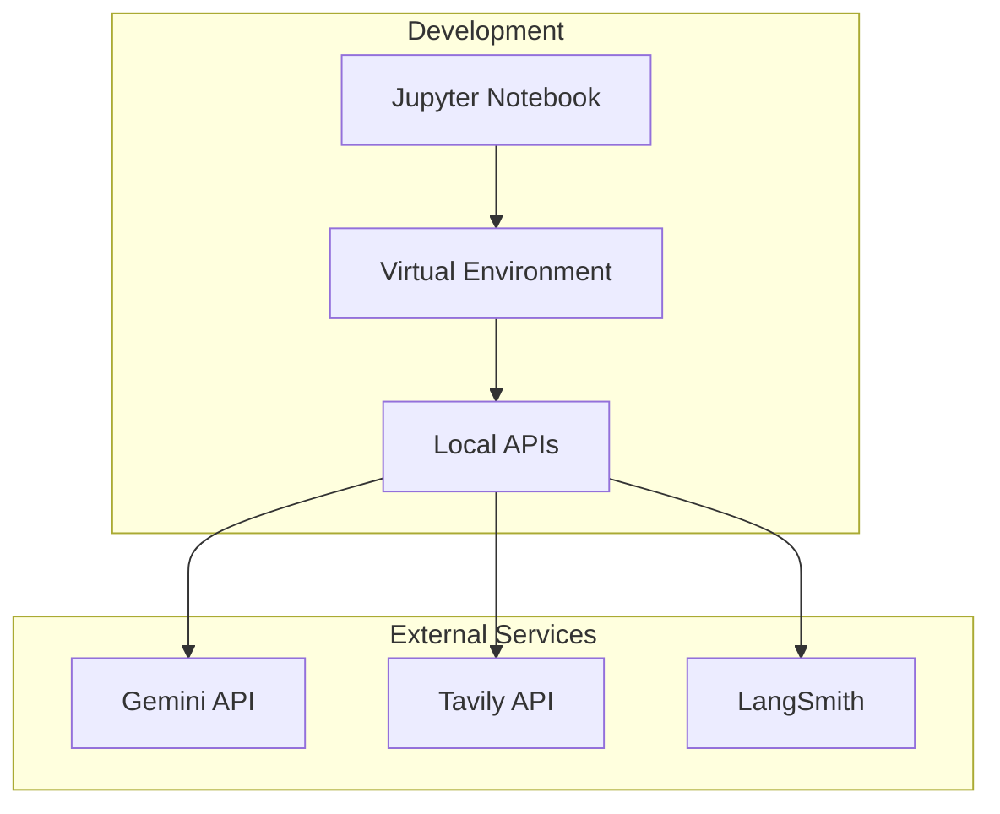

# Architecture

This document describes the high-level architecture of the Research Collective system, including its components, interactions, and design patterns.

## System Overview

The Research Collective is built as a multi-agent system using LangGraph, where specialized AI analysts work in parallel to research topics through structured interviews with expert AIs.

## High-Level Architecture

## Component Architecture

### 1. LangGraph Engine
The core orchestration engine that manages the entire workflow.

**Responsibilities:**
- Graph execution and state management
- Node coordination and routing
- Parallel processing with Send API
- Human-in-the-loop interactions

**Key Components:**
- StateGraph: Main graph structure
- MemorySaver: State persistence
- Checkpointer: Session management

### 2. Agent Layer

#### Analyst Generator
Creates specialized AI analyst personas based on the research topic.

#### Individual Analysts
Each analyst is a specialized AI persona with:
- **Role**: Specific function (e.g., Technical Expert, Business Analyst)
- **Affiliation**: Organization or perspective
- **Focus**: Particular aspect of the research topic
- **Persona**: Character and communication style

#### Expert AI
The knowledge-gathering system that:
- Receives questions from analysts
- Searches multiple data sources
- Synthesizes information
- Provides comprehensive answers

### 3. Data Integration Layer

### 4. State Management Architecture

The system uses a hierarchical state structure:

## Data Flow Architecture

### 1. Input Processing

### 2. Parallel Interview Processing

### 3. Interview Sub-Graph Architecture
Each interview runs as an independent sub-graph:

## Integration Architecture

### API Integration Layer

## Security & Configuration Architecture

### Environment Management

## Scalability Architecture

### Horizontal Scaling
The system is designed for horizontal scaling through:

1. **Parallel Processing**: Multiple interviews run simultaneously
2. **Stateless Components**: Most components can be scaled independently
3. **External APIs**: Leverages scalable cloud services
4. **Modular Design**: Components can be deployed separately

### Performance Optimization

## Error Handling Architecture

### Resilience Patterns

## Deployment Architecture

### Development Environment

### Production Considerations
For production deployment, the architecture would include:
- Container orchestration (Docker/Kubernetes)
- API gateway for external service management
- Database for state persistence
- Load balancing for high availability
- Monitoring and alerting systems

## Key Design Principles

1. **Modularity**: Each component has a single responsibility
2. **Scalability**: Parallel processing and stateless design
3. **Resilience**: Error handling and graceful degradation
4. **Observability**: Comprehensive logging and tracing
5. **Flexibility**: Human-in-the-loop for customization
6. **Extensibility**: Easy to add new data sources or agents
