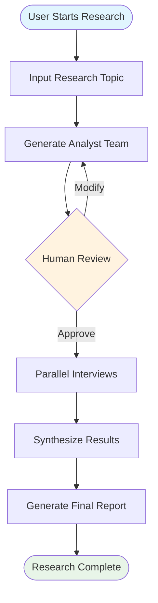
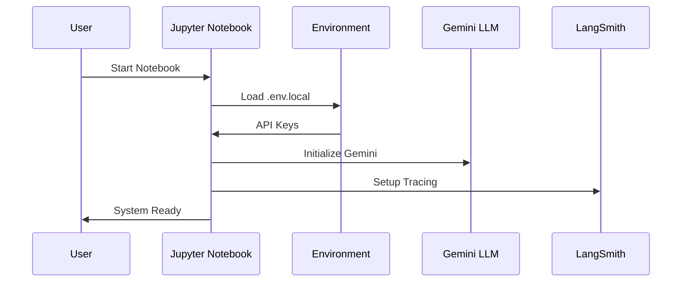
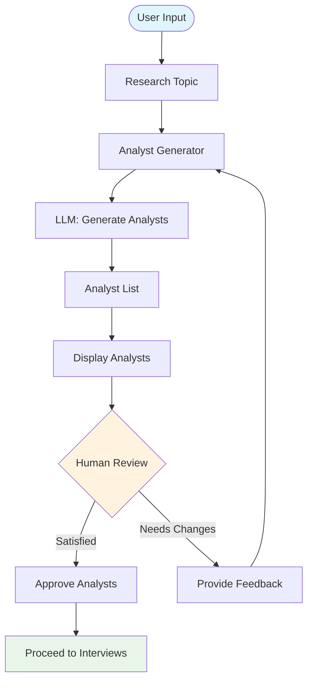
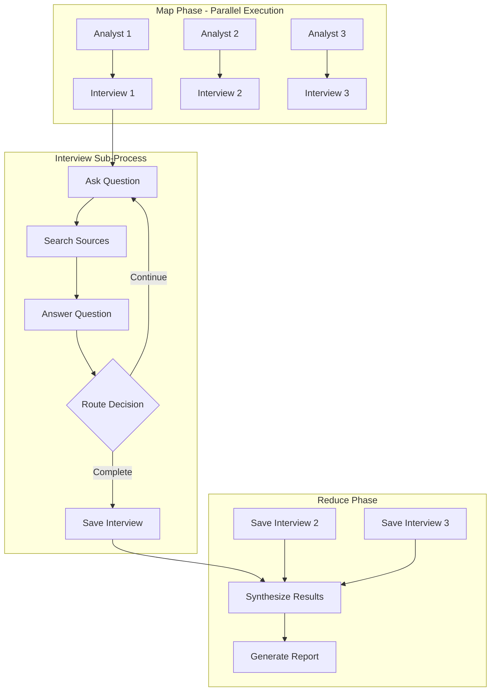
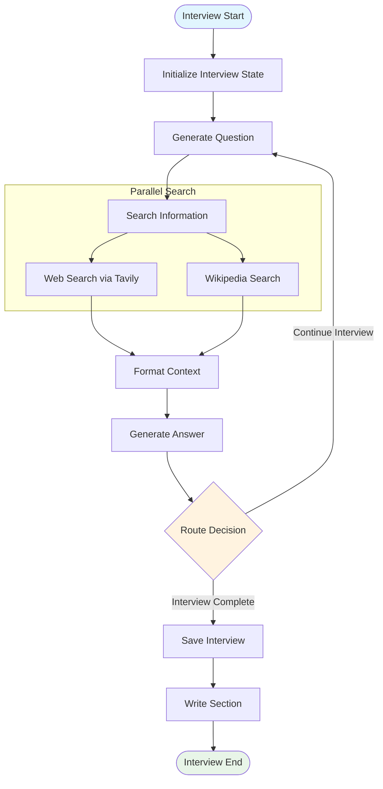
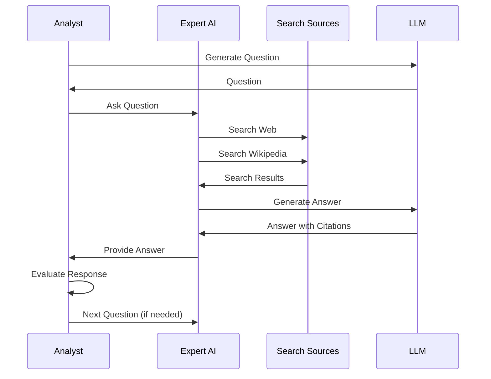
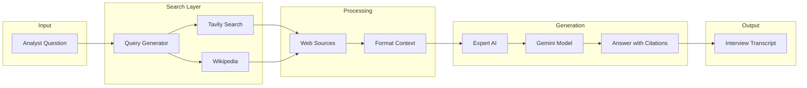
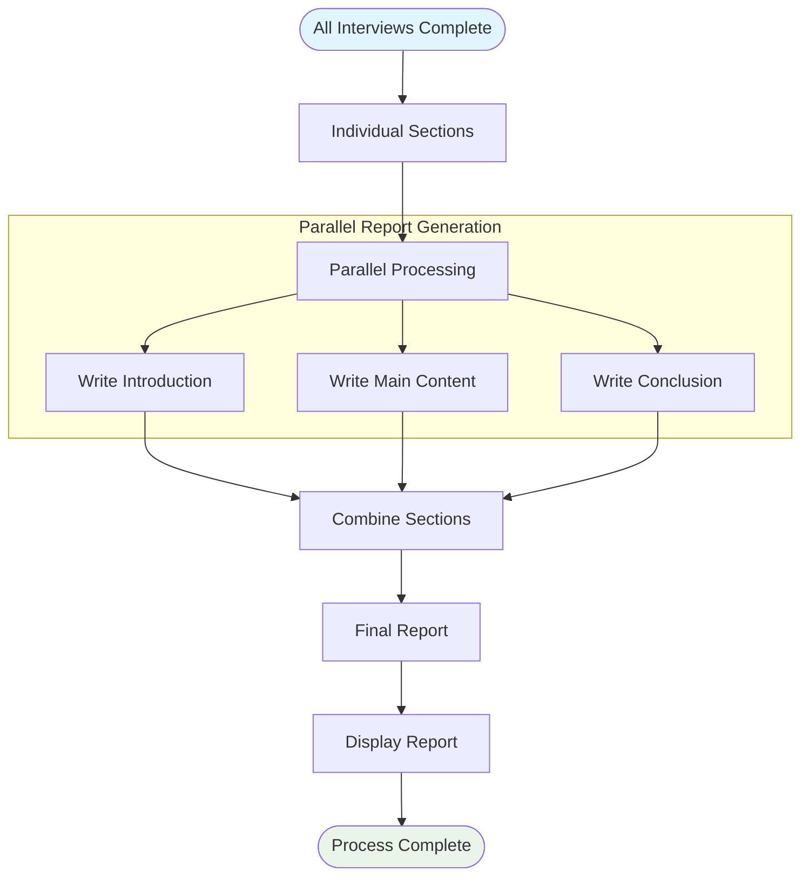
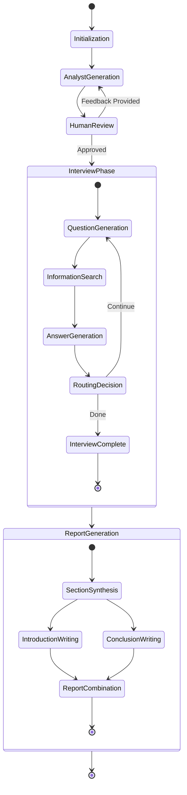
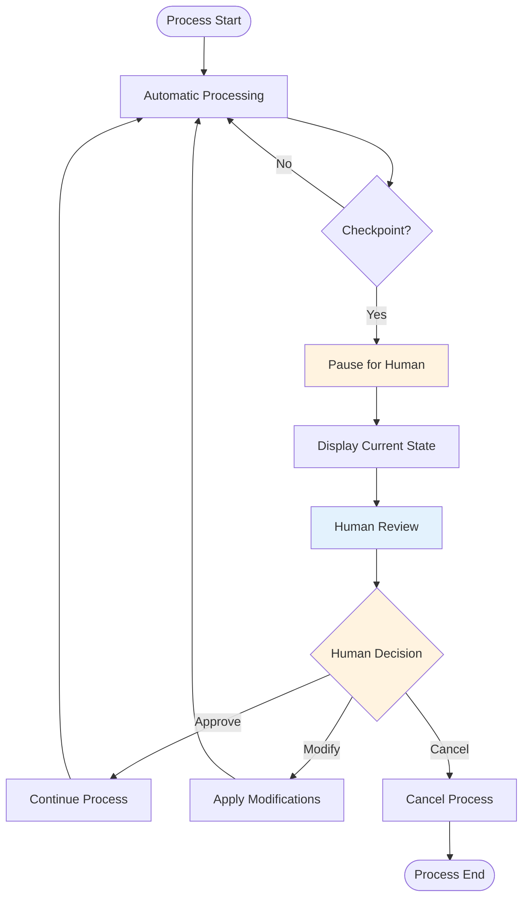

# Project Flow

This document describes the detailed flow of the Research Collective system, including step-by-step processes and decision points.

## Overall System Flow

## Detailed Process Flow

### Phase 1: Initialization and Setup

### Phase 2: Analyst Generation Flow

### Phase 3: Parallel Interview Flow

## Individual Interview Flow

### Interview Sub-Graph Process

### Question-Answer Cycle

## Data Flow Through the System

### Information Gathering Flow

## Report Generation Flow

### Synthesis and Report Creation

## State Management Flow

### State Transitions

## Human-in-the-Loop Flow

### Human Interaction Points

