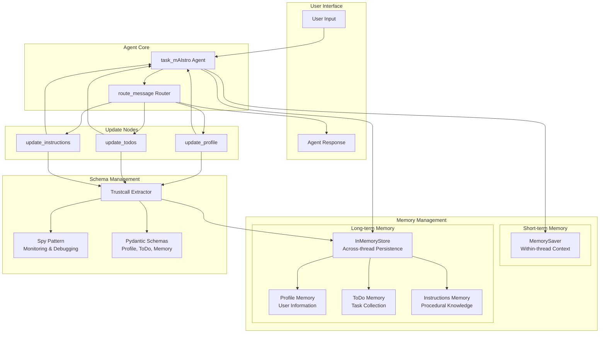
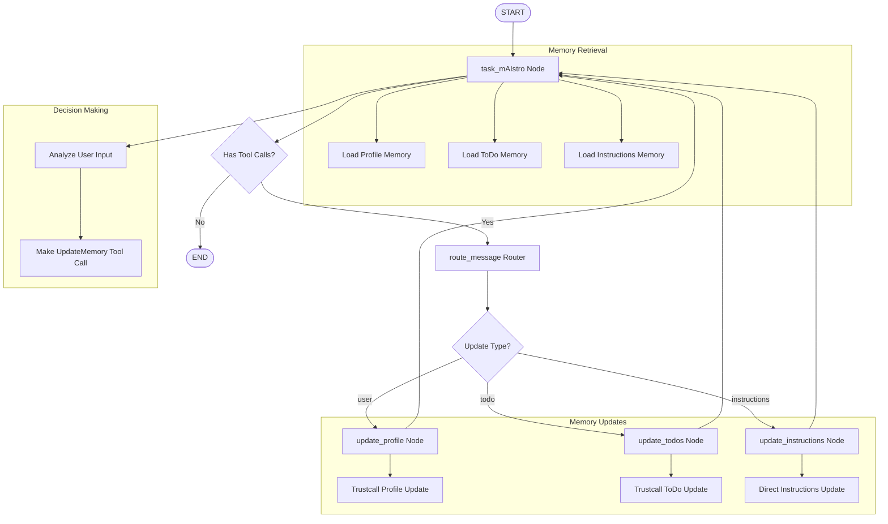
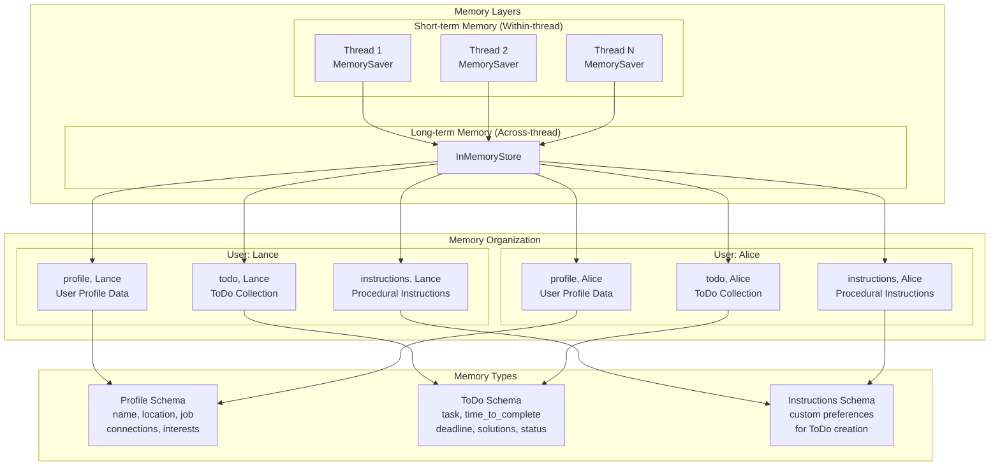
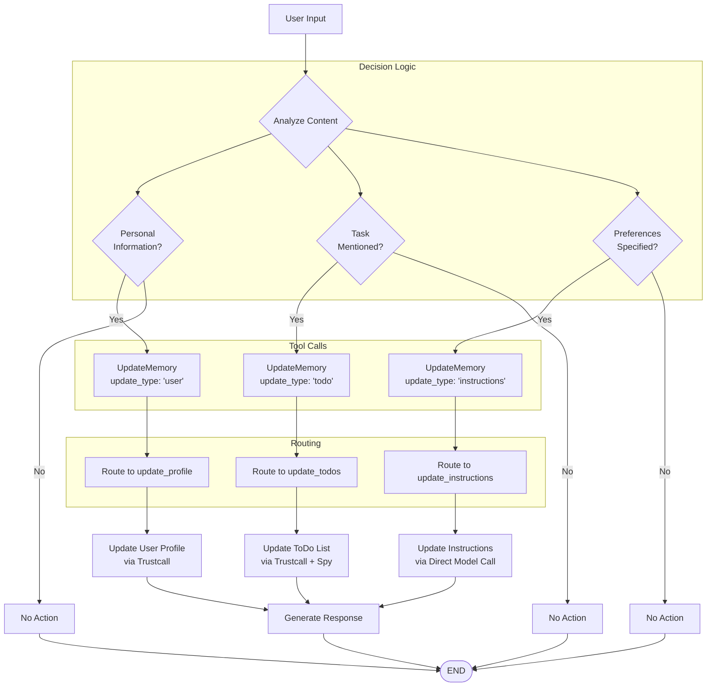
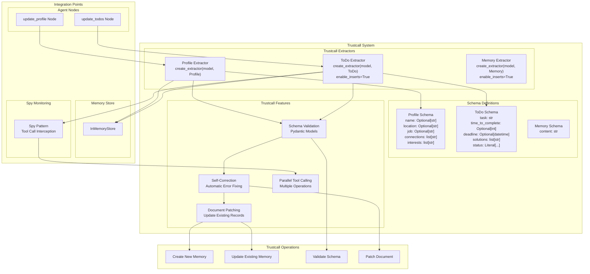

# Agent with Long-Term Memory - System Diagrams

This document contains visual diagrams to help understand the `task_mAIstro` agent system architecture and flow.

## 1. System Architecture Overview

## 2. LangGraph Flow Diagram

## 3. Memory Architecture Diagram

## 4. Tool Calling Decision Tree

## 5. Trustcall Integration Diagram

## Diagram Usage Notes

### System Architecture Overview
- Shows the complete system with all major components
- Illustrates data flow between agent, memory stores, and schema management
- Highlights the dual-layer memory architecture

### LangGraph Flow Diagram
- Demonstrates the agent's decision-making process
- Shows conditional routing based on tool calls
- Illustrates the circular flow back to the main agent node

### Memory Architecture Diagram
- Visualizes the separation between short-term and long-term memory
- Shows namespace organization by user and memory type
- Demonstrates schema relationships

### Tool Calling Decision Tree
- Shows the agent's logic for deciding when to update memory
- Illustrates the three types of memory updates
- Demonstrates the routing mechanism

### Trustcall Integration Diagram
- Details how Trustcall manages schema-based memory operations
- Shows self-correction and validation capabilities
- Illustrates integration with the spy pattern for monitoring

These diagrams provide a comprehensive visual understanding of the `task_mAIstro` agent system, from high-level architecture to detailed implementation patterns.
